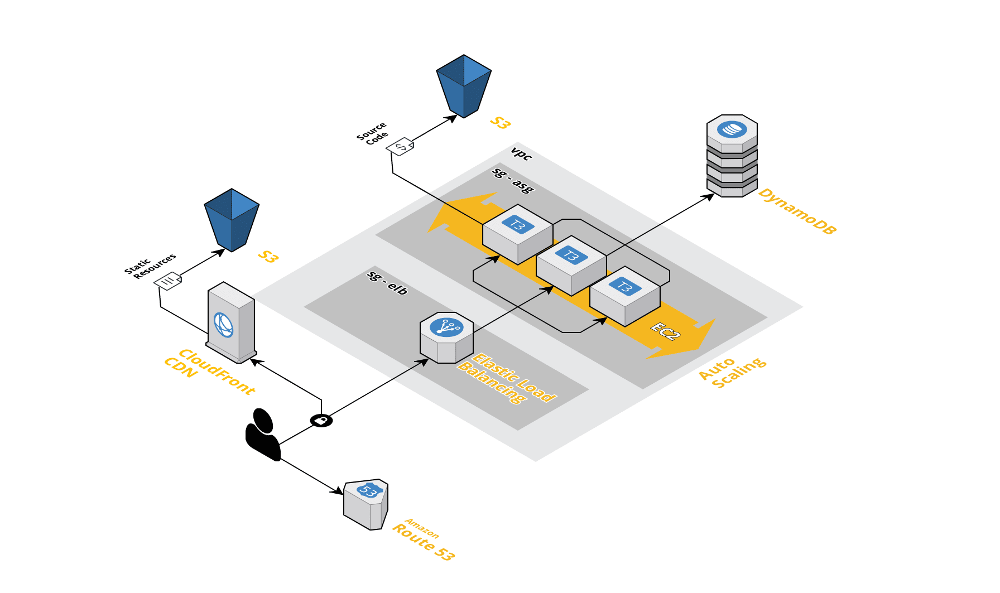

# Taxonomy Annotator

The "Taxonomy Annotator" is a crowd based human-in-the-loop application for producing training data. The user annotates word-pairs with their potential relation type like "synonym", "antonym", "hypernym", and the annotations are written into a central database. Afterwards a machine learning model can be trained for predicting relations by itself.

  

Give it a try! https://www.annotator-capstone.ml

 
Start with loading an word embedding - then the current annotations-history under "Annotations" - and generate the graph.

Afterwards you can continue to produce your own annotations by writing new terms and link them by holding left-click and draging a line. To annotate the relation type, just right-click the now created edge, or press one of the fields at the bottom-bar.

A more detailed explanation on the use of the application, you can find below.

 

## AWS - Architecture
This web application was hosted on the AWS Cloud. Here you can see the setup of the corresponding cloud-services:

