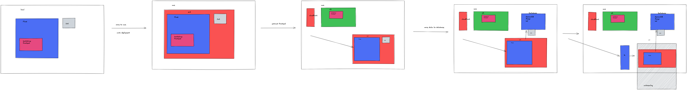

# AWS Capstone Project - Taxonomie Anaotator

This is the repository for my aws capstone project which consists of a human in the loop (HITL) single page application for annotating word taxonomies.

## Goal
With using the application, new training data should be generated and stored in a non-relational database in the aws cloud. Overall architecture:

